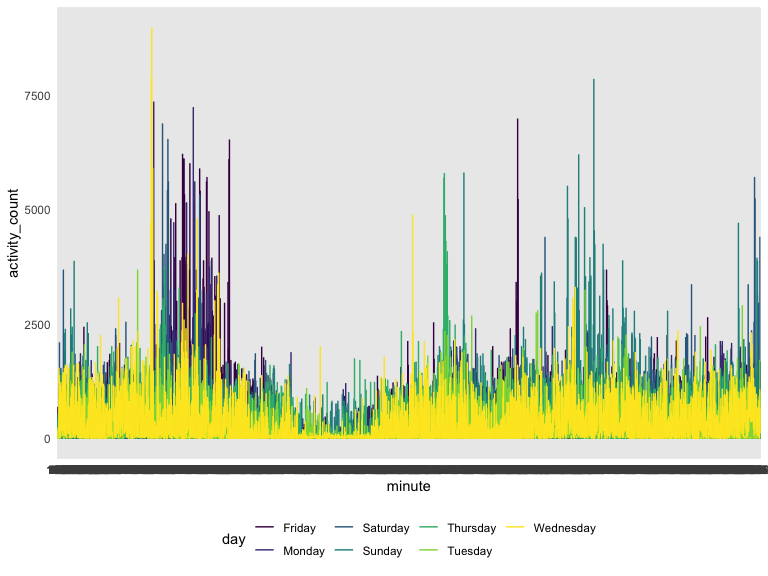
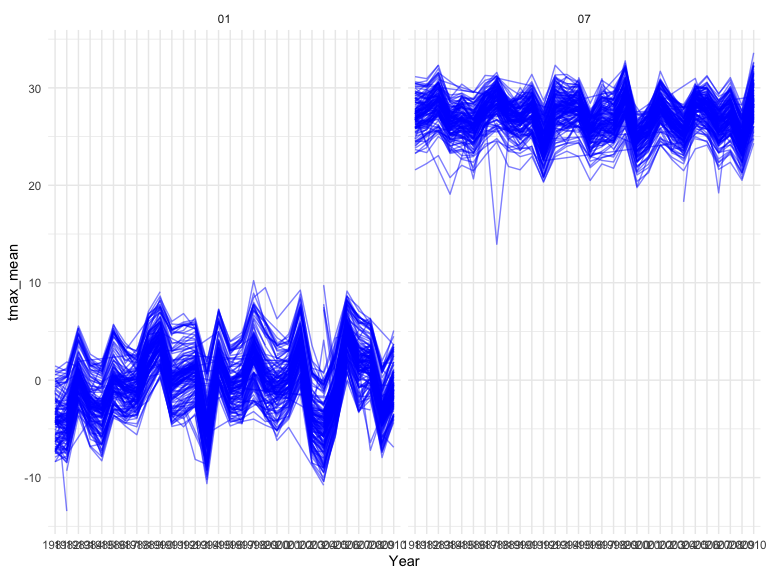
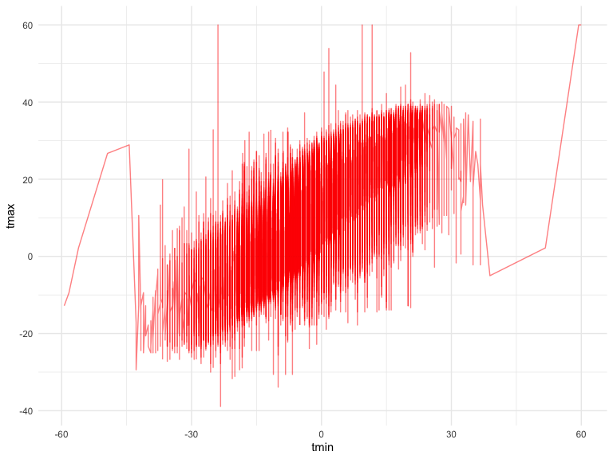
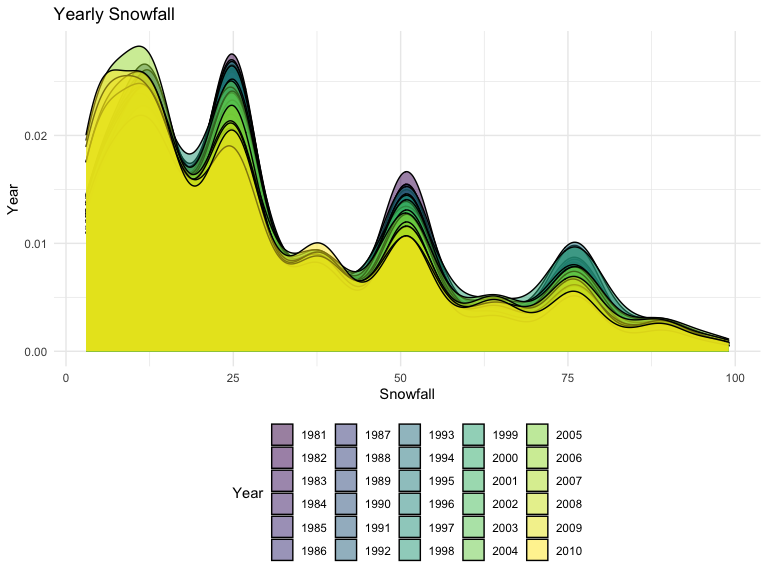

p8105_hw3_bes2161.Rmd
================
Brittany Shea
2022-10-17

### Problem 1

#### Read in the data

``` r
data("instacart")

instacart = 
  instacart %>% 
  as_tibble(instacart)
```

#### Description of the dataset

The dataset has 1384617 rows and 15 columns. Each row represents an
Instacart order. Variables include user, product, and order which
includes day, time, and days since previous order. Product names,
department, aisle, and order history are also included. There are 39123
products found in 131209 orders from 131209 distinct users.

Here is a table that summarizes how many items were ordered from aisles.
There are a total of 134 aisles, and the most ordered items are ordered
from aisles with fresh vegetables and fresh fruits.

``` r
instacart %>% 
  count(aisle) %>% 
  arrange(desc(n))
```

    ## # A tibble: 134 × 2
    ##    aisle                              n
    ##    <chr>                          <int>
    ##  1 fresh vegetables              150609
    ##  2 fresh fruits                  150473
    ##  3 packaged vegetables fruits     78493
    ##  4 yogurt                         55240
    ##  5 packaged cheese                41699
    ##  6 water seltzer sparkling water  36617
    ##  7 milk                           32644
    ##  8 chips pretzels                 31269
    ##  9 soy lactosefree                26240
    ## 10 bread                          23635
    ## # … with 124 more rows

Here is a plot with the number of items ordered in each aisle, in
ascending order by number of items.

``` r
instacart %>% 
  count(aisle) %>% 
  filter(n > 10000) %>% 
  mutate(aisle = fct_reorder(aisle, n)) %>% 
  ggplot(aes(x = aisle, y = n)) + 
  geom_point() + 
  labs(title = "Number of items ordered in each aisle") +
  theme(axis.text.x = element_text(angle = 60, hjust = 1))
```


Here is a table which shows the top three popular items in each of the
aisles `baking ingredients`, `dog food care`, and
`packaged vegetables fruits`, and includes the number of times each item
is ordered.

``` r
instacart %>% 
  filter(aisle %in% c("baking ingredients", "dog food care", "packaged vegetables fruits")) %>%
  group_by(aisle) %>% 
  count(product_name) %>% 
  mutate(rank = min_rank(desc(n))) %>% 
  filter(rank < 4) %>% 
  arrange(desc(n)) %>%
  knitr::kable()
```

| aisle                      | product_name                                  |    n | rank |
|:---------------------------|:----------------------------------------------|-----:|-----:|
| packaged vegetables fruits | Organic Baby Spinach                          | 9784 |    1 |
| packaged vegetables fruits | Organic Raspberries                           | 5546 |    2 |
| packaged vegetables fruits | Organic Blueberries                           | 4966 |    3 |
| baking ingredients         | Light Brown Sugar                             |  499 |    1 |
| baking ingredients         | Pure Baking Soda                              |  387 |    2 |
| baking ingredients         | Cane Sugar                                    |  336 |    3 |
| dog food care              | Snack Sticks Chicken & Rice Recipe Dog Treats |   30 |    1 |
| dog food care              | Organix Chicken & Brown Rice Recipe           |   28 |    2 |
| dog food care              | Small Dog Biscuits                            |   26 |    3 |

Here is a 2 x 7 table that shows the mean hour of the day when Pink Lady
Apples and Coffee Ice Cream are ordered on each day of the week. Pink
Lady Apples are purchased earlier in the day than Coffee Ice Cream,
except for day 5.

``` r
instacart %>%
  filter(product_name %in% c("Pink Lady Apples", "Coffee Ice Cream")) %>%
  group_by(product_name, order_dow) %>%
  summarize(mean_hour = mean(order_hour_of_day)) %>%
  spread(key = order_dow, value = mean_hour) %>%
  knitr::kable(digits = 2)
```

    ## `summarise()` has grouped output by 'product_name'. You can override using the
    ## `.groups` argument.

| product_name     |     0 |     1 |     2 |     3 |     4 |     5 |     6 |
|:-----------------|------:|------:|------:|------:|------:|------:|------:|
| Coffee Ice Cream | 13.77 | 14.32 | 15.38 | 15.32 | 15.22 | 12.26 | 13.83 |
| Pink Lady Apples | 13.44 | 11.36 | 11.70 | 14.25 | 11.55 | 12.78 | 11.94 |

### Problem 2

#### Read in and clean the data

``` r
accel_data = 
  read_csv("./data/accel_data.csv") %>%
  janitor::clean_names() %>%
  pivot_longer(
    activity_1:activity_1440,
    names_to = "minute",
    names_prefix = "activity_",
    values_to = "activity_count") %>%
  mutate(wday_wend = ifelse(day %in% c("Saturday", "Sunday"), "weekend", "weekday"))
```

    ## Rows: 35 Columns: 1443
    ## ── Column specification ────────────────────────────────────────────────────────
    ## Delimiter: ","
    ## chr    (1): day
    ## dbl (1442): week, day_id, activity.1, activity.2, activity.3, activity.4, ac...
    ## 
    ## ℹ Use `spec()` to retrieve the full column specification for this data.
    ## ℹ Specify the column types or set `show_col_types = FALSE` to quiet this message.

This dataset includes 50,400 rows and 6 total columns. The variables
include the week number, day id, day of the week, activity count for
each minute of a 24-hour day starting at midnight, and whether the day
is during the week or on a weekend.

#### Table showing total activity variable for each day

``` r
accel_data %>% 
  group_by(day_id) %>% 
  summarize(sum(activity_count)) %>% 
  knitr::kable(digits = 2)
```

| day_id | sum(activity_count) |
|-------:|--------------------:|
|      1 |           480542.62 |
|      2 |            78828.07 |
|      3 |           376254.00 |
|      4 |           631105.00 |
|      5 |           355923.64 |
|      6 |           307094.24 |
|      7 |           340115.01 |
|      8 |           568839.00 |
|      9 |           295431.00 |
|     10 |           607175.00 |
|     11 |           422018.00 |
|     12 |           474048.00 |
|     13 |           423245.00 |
|     14 |           440962.00 |
|     15 |           467420.00 |
|     16 |           685910.00 |
|     17 |           382928.00 |
|     18 |           467052.00 |
|     19 |           371230.00 |
|     20 |           381507.00 |
|     21 |           468869.00 |
|     22 |           154049.00 |
|     23 |           409450.00 |
|     24 |             1440.00 |
|     25 |           260617.00 |
|     26 |           340291.00 |
|     27 |           319568.00 |
|     28 |           434460.00 |
|     29 |           620860.00 |
|     30 |           389080.00 |
|     31 |             1440.00 |
|     32 |           138421.00 |
|     33 |           549658.00 |
|     34 |           367824.00 |
|     35 |           445366.00 |

It appears that activity decreases toward the beginning of the week; for
example, Tuesdays appear to be a day with less activity compared to
other days. However, activity seems to be higher on the weekends.

#### Single-panel plot showing the 24-hour activity time courses for each day

``` r
accel_data %>% 
  group_by(day_id) %>% 
  ggplot(aes(x = minute, y = activity_count)) + 
  geom_line(aes(color = day))
```



This graph shows there are peaks and dips in activity levels throughout
the day. Activity increases in the beginning of the day, then decreases,
and picks up again towards the end of the day. It also appears that
activity is generally higher on weekends compared to weekdays.

### Problem 3

### Read in the data

``` r
data("ny_noaa")
```

### Description of the data

This dataset includes data on five variables for all NY weather stations
from January 1, 1981-December 31, 2010. There are 2,595,176 rows and 7
total columns. The dataset includes variables such as id, date,
precipitation, snowfall, snow depth, and maximum and minimum
temperatures. There are several missing values (NAs) for each of these
variables.

### Clean the data

``` r
ny_noaa <- ny_noaa %>%
  janitor::clean_names() %>%
  mutate(tmax = as.numeric(tmax),
         tmin = as.numeric(tmin),
         prcp = as.numeric(prcp),
         snow = as.numeric(snow),
         snwd = as.numeric(snwd)) %>%
  mutate( 
    tmin = tmin / 10,
    tmax = tmax / 10,
    prcp = prcp / 10) %>%
  separate(date, c("Year", "Month", "Day"))
```

#### Most commonly observed values for snowfall

``` r
ny_noaa %>%
  group_by(snow) %>%
  summarize(n()) %>%
  top_n(2)
```

    ## Selecting by n()

    ## # A tibble: 2 × 2
    ##    snow   `n()`
    ##   <dbl>   <int>
    ## 1     0 2008508
    ## 2    NA  381221

For snowfall, the most commonly observed values are 0 and NA as weather
stations do not collect all of the same variables. Some of the stations
only report precipitation data. Additionally, snow does not fall for
several months of the year.

### Two-panel plot showing the average max temperature in January and July in each station across years

``` r
ny_noaa %>%
  group_by(Month, Year, id) %>%
  filter(Month %in% c("01", "07")) %>%
  summarize(tmax_mean = mean(tmax, na.rm = TRUE)) %>%
  ggplot(aes(x = Year, y = tmax_mean, group = id)) +
  geom_line(alpha = 0.5, color = "blue") + facet_grid(~ Month)
```

    ## `summarise()` has grouped output by 'Month', 'Year'. You can override using the
    ## `.groups` argument.



The average max temperature in January is lower than that in July in
each station across years. There are some outliers, for example the
temperature in January dropped lower during some years than other years,
and some years the temperature dropped comparatively lower in July. It
also appears that the average max temperature in January is increasing
slightly.

#### Two-panel plot showing tmax vs tmin for the full dataset

``` r
ny_noaa %>%
  group_by(tmax, tmin) %>%
  ggplot(aes(x = tmin, y = tmax)) +
  geom_line(alpha = 0.5, color = "red")
```



#### Plot showing distribution of snowfall values greater than 0 and less than 100 separately by year

``` r
ny_noaa %>% 
  filter(snow > 0 & snow < 100) %>%
  ggplot(aes(x = snow, fill = Year)) +
  geom_density(alpha = .5) +
  theme(legend.position = "none") %>%
  labs(
    title = "Yearly Snowfall",
    x = "Snowfall",
    y = "Year"
  )
```


